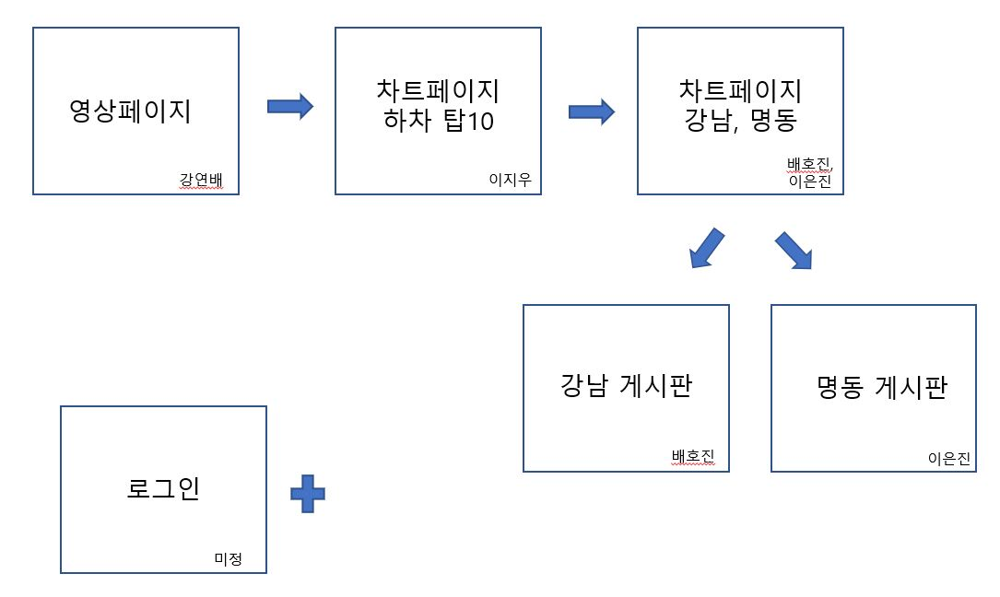

## 2월13일 첫 회의부터 2월 14일까지의 회의
2차 프로젝트는 


를 사용하여 1차프로젝트때 하였던것에 게시판과, 로그인을 백앤드와 연결하여 사용자 편의 사이트를 제작하는 프로젝트를 진행하였습니다.

대부분 프로젝트 주제를 변경하는반면
저희조는 1차때 하였던 여행이라는 주제를 가지고 계속하여 진행하는 방향으로 결정되어진 첫 회의였습니다.

이번 프로젝트 필수 요건은, 차트 4개이상, 로그인, 게시판 입니다.

다만 좀더 디테일하게 자료들이 들어가야하기에
큼직한 도시들에서 서울시로 지역 변동이 되었습니다.

<hr>

## 2월 14일 
공공데이터포털(www.data.go.kr) 에서 서울시 승하차유동인구로 데이터를 뽑아 여행에 추천할만한 12개역을 뽑았습니다. 
로 파일을 정리하고

를 이용해 하차 Top12개역 차트를 구현했습니다.

## 2월 15일

디테일한 화면 구성이 결정되었습니다.

  

첫화면은 주제가 서울여행인만큼 메인 페이지는 들어가자마자 서울 홍보영상이 플레이되며,

두번째 페이지는 하차기준 Top10개의 역에대한 그래프가 들어갈 예정입니다.

게시판은
여행에관련한것으로 구성하여 숨은맛집등을 로그인한 회원들이 각자 업로드할수있도록 제작하는것으로 하였습니다.

<hr>

첫번째 페이지(메인페이지)는 바로 완성이 되었습니다.
확실히 1차 프로젝트때 많이 시도를해봐서 보다 쉽게 제작하였습니다.


약 46초간 진행되며, 영상이끝나면 자동으로 다음페이지로 넘어갈 수 있도록 되어져있습니다.

## 2월 16일

### Oracle 과 로그인페이지 연결완료!!!

처음 Oracle과 연결없이,  에 if, else 값으로 로그인 연결을 해두었었는데,
이번에는 로그인페이지를 Oracle 과 연결 성공 하였습니다.!

기본 기존에 nodeJS 에서 했던 코드와는 좀 많이달라졌습니다.
> 내가 원한것
- localhost:3000 을 실행하였을때 제일먼저뜨는것이 메인 영상페이지
- 영상실행 후 자동으로 로그인페이지로 넘어가기
- 로그인은 Oracle table 에 저장되어져있는 ID와 Password 값으로 로그인성공하기.
- 실패시 실패 메세지 나오기
- 성공 후 연결페이지는 영상페이지가 아닌 일반페이지.

### 기존코드(Oracle 연결전 NodeJS로만 로그인페이지 처리 코드)
```js
const express = require('express')
const path = require('path')
const app = express()
const port = 3000


app.set('view engine', 'ejs');

// root 폴더는 현재폴더로 설정
app.use(express.static(__dirname));

// req.body 해독을 위한 미들웨어 장착
app.use(express.urlencoded({ extended: true }));

// views 폴더 경로 변경
app.set('views', path.join(__dirname, 'public', 'views'));


// 메인페이지는 index.html
app.get('/', (req, res) => {
    res.sendFile(__dirname, 'index.html')
})

// 로그인 시도시 데시보드로 이동
app.post('/dashboard',(req,res)=>{
    const {username, password} = req.body

    if (username==='kang' && password==="1111"){
        res.render('dashboard',{username})
    }

})

app.listen(port, () => {
    console.log(`Example app listening at http://localhost:${port}`);
});
```

### 새로 작성되어진 코드 (Oracle과 연결되어진코드)
```js
const express = require('express');
const bodyParser = require('body-parser');
const oracledb = require('oracledb');
const session = require('express-session');
const dbConfig = require('./dbconfig');
const path = require('path'); // path 모듈 추가

oracledb.autoCommit = true;

const app = express();
const port = 3000;

// express-session 미들웨어 설정
app.use(session({
    secret: 'mySecretKey', // 세션을 암호화하기 위한 임의의 키
    resave: false,
    saveUninitialized: true,
    //세션의 유지시간 기본값은 브러우져 종료시까지 유지
    cookie: {
        maxAge: 5000 // 단위는 밀리세컨드
    }
}));

app.set('view engine', 'ejs');
app.set('views', path.join(__dirname, 'public', 'views')); // views 디렉토리 설정

const server = app.listen(3000, () => {
    console.log(`Server is running at http://localhost:3000`);
});
// 정적인 파일 참조를 nginx html 폴더로 지정 (이 파일을 참조해야 오라클에서 db를 불러올수있음 꼭필요함!!!)
// 개발환경
const WEB_SERVER_HOME = 'C:\\KYB\\Util\\nginx-1.24.0\\html';
// AWS환경
// const WEB_SERVER_HOME = '/usr/share/nginx/html';

app.use(express.static(__dirname)); //서버를 구동시켰을때 기준되는 폴더구조 :(__dirname) > 현재폴더 : index.html을 기본으로 잡아줌

app.set('views', path.join(__dirname, 'public', 'views')); // views 폴더 위치 지정.


// 개발환경
oracledb.initOracleClient({liDir: '../intantclient_21_13'});
// AWS환경
// oracledb.initOracleClient({liDir: '/usr/lib/oracle/21/client64/lib/'});

app.post('/dashboard', bodyParser.urlencoded({ extended: false }), async (req, res) => {
    // 위에서 app.set('views', path.join(__dirname, 'public', 'views')); 이거로 views 폴더위치를 지정해주었기때문에,
    // /dashboard 만 적어도 현재폴더 > public > views 폴더 안에있는 dashboard 를 잡아준다.
    // 로그인시 페이지를 의미한다.

     const {username, password} = req.body;

    // 사용자 인증 작업
   const authenticatedUser = await varifyID(username, password);

    //인증 성공시 웰컴 페이지로 라우팅
    if(authenticatedUser){
        req.session.loggedIn = true; // 세션에 loggedIN 이라는 변수 생성 및 초기화
        req.session.username = username;
        res.render('dashboard',{username});
    }else{
        res.render('loginFail', {username})
    }

});

async function varifyID(username, password) {
    let connection;

    try{
        connection = await oracledb.getConnection(dbConfig);
        sql_query = 'select * from users where username = :username and password = :password';
        //execute([SQL 쿼리],[바인딩 정보],[옵션]);
        // 바인딩 정보는 기존 SQL 쿼리에서 자바스크립트 변수를 사용할 수 있게 하는 매핑 정보
        const result = await connection.execute(sql_query, {username,password})

        if(result.rows.length > 0){
            console.log(result.rows[0]);
            // 간단한 쿼리의 경우는 execute 함수에 3번째 인자 생략해도 컬럼명으로 접근 가능.
            return{
                id : result.rows[0].ID,
                username: result.rows[0].USERNAME,
                name: result.rows[0].NAME
            };
        }else {
            return null; //인증이 실패한 경우
        }

    }catch(error){
        console.error('오류발생 : ', error);

    }finally {

    }

}

```

열심히 로그인용 nodeJS 코드를 뜯어보고 공부한결과 원하는 형태의 페이지를 완성했습니다.
이제 남은것은 이후 팀원들에게 요청한 차트가 들어간페이지와 게시판 페이지 연결,
그리고 3000 포트를 실행시 login과 게시판여러개가 모두 한번에실행되어질 수 있도록 NodeJS 합쳐보기입니다.

찾아보니 3000번 포트가 실행될수있는 메인 index.js 를만들고 그안에 
html 에 <script>로 js 파일을 넣어 실행시킬 수 있듯
js 안에도 js 를 넣어 실행시킬수 있다는 내용을 찾앗습니다.

명령어는
```js
app.use('/', require('./routes/post.js') );
```

하여 이부분도 프로젝트 기간동안 열심히 고민하여 성공해보도록 하겠습니다.
방법이 눈에 보이는만큼 빠르게 나도 게시판을 하나 만들어 로그인과 게시판을 한포트로 합치는것을 공부할예정입니다.


## 2월 19일

### 폴더구조를 변경하여
### 백엔드와 로그인페이지를 재연결하였습니다.

 를 여러개로 나눠 router 함수를 활용하여, 게시판과, 로그인페이지를 하나의 js에 하위 js를 나눠 연결하는것을 성공하였습니다.

나눠진 js 파일을 가지고 공부하면 훨씬 빠르게 코드이해가 가능할듯합니다.


## 2월 21일

## Oracle Table로 chart를 만들다!!
### 오라클에 실제데이터를 table 로 넣어
### 그값을 불러와 chartJS로 만들어 화면에 띄우는것을 성공하였습니다

이번 팀프로젝트 과제중 중요한 부분인 차트페이지를 넣었습니다.
교수님께서는 처음에 랜덤값으로 차트를 넣는 방법으로 말씀하셨지만,
저희는 3차때 실시간데이터를 넣을 부분을 고려하여,
차트의 데이터 베이스는  Oracle 에서 받아오는 방법으로 제작하였습니다.
```
차트는 총 4개가 들어가야하며,
그중 Oracle 데이터베이스로 차트만들기를 하였으며,
이지우님과 강연배가 성공하여 연결하였습니다.
```

## 2월 22일 
이지우 - 서비스 홈페이지에 대해 사용자의 자유게시판을 만들기 시작했습니다

## 2월 23일

강연배 - 게시판 시작.

처음만드는 게시판.
공지사항게시판을 제작할 예정입니다.


### 2월 27일

강연배 - 게시판 완료
제가맡은 게시판은 공지사항 게시판으로,
system (관리자) 로 로그인할 경우에만 글작성이 가능합니다.
덧글은 누구나 작성 가능합니다.
이제 남은것은 챗봇 업그레이드와, css 입니다.

### 3월 4일

이지우 - 자유게시판 구현완료
좋아요 기능을 추가 구현했으며 1명당 한번씩만 누를수있고 한번 누르면 최소할 수 없습니다.


### 3월 5일 

이지우 - 회원가입 기능 완료
